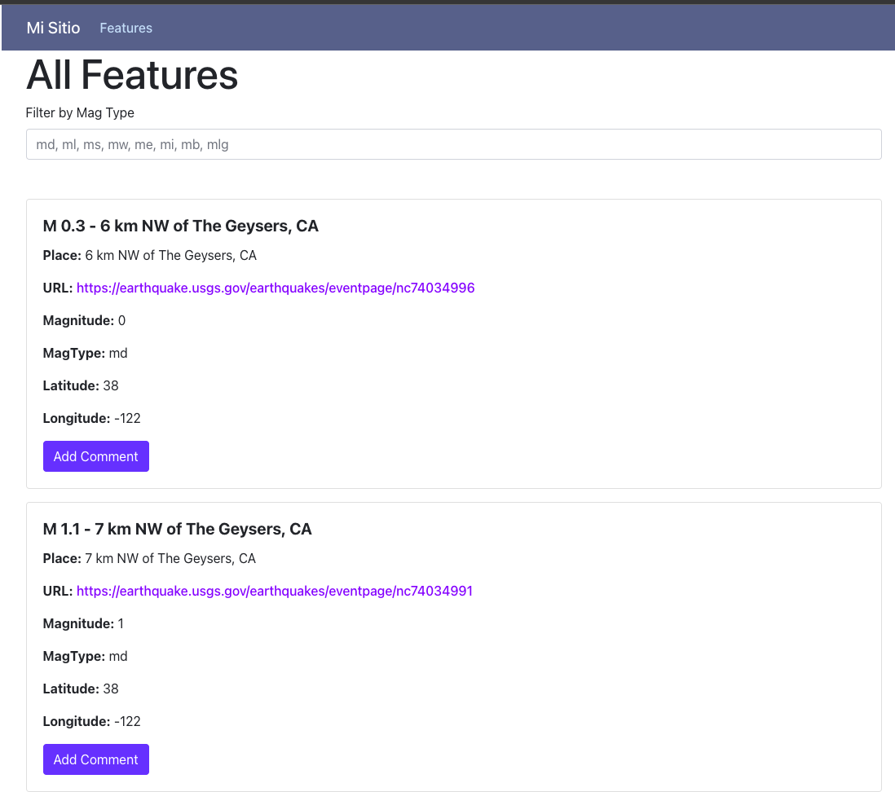

# README FROGMI

Technical Test 

### Technologies Used
    * Rails 7
    * Ruby 3.2.0
    * Bootstrap 5
    * MySql 8
    * Docker 4.19 (on MacBook)
    * Docker Compose
    * ReactJS
    * Nginx

### Steps to running Projects

    * docker compose build
    * docker composer up

### Execute task
    * rake seismic_data:fetch

### Helpers
    * docker compose exec app bash
    * docker-compose exec frontend sh

### Screeshots
#### - FrontEnd

Features

Comment
